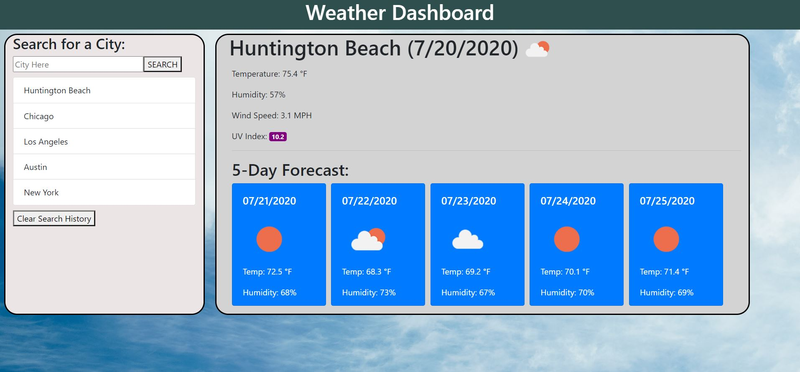

# Weather Dashboard
UCI Boot Camp Homework 06 - Weather Dashboard

This was the sixth homework assignment for the full stack web development program at UC Irvine, in which the goal was to build a weather dashboard where the user can input a city and get the necessary weather information for that city. It should also have a search history that is selectable for weather information as well. 

# link to deployed application:
https://maxx105.github.io/weather_dashboard/

# image of deployed application:

# Technologies:
For this project, I used HTML and CSS as well as Bootstrap for additional styling. I used JQuery and ajax for retrieving data from the Open Weather API (https://openweathermap.org/api).

# Purpose:
This is meant to serve as a small and simple weather application. It allows the user to get the current temperature, humidity, windspeed, and UV index for any city as well as a five day forecast for that city.

# How to use: 
To use this application, simply type in the city in the text field under "Search for a City:" and click the search button. If that city is part of the Open Weather API, it will display the city, the country, the date, an icon displaying the current weather condition, the current temperature, the current humidity, the current wind speed, the current UV Index, and a 5-day forecast which, for each day, shows the date, the icon that represents the weather condition, the high temperature, and the humidity. The UV index will be a different color depending on the severity (green for under three, yellow for between 3 and 6, orange for between 6 and 7, red for between 7 and 10, and purple for greater than 10). Also, when the search button is pressed, it will appened your searched city below the "Search for a City" form. It saves those to the local storage and you can click any of your searched items at any time to display the weather information for that city. You can also clear your search history at any time by clicking the "Clear search history" button.

